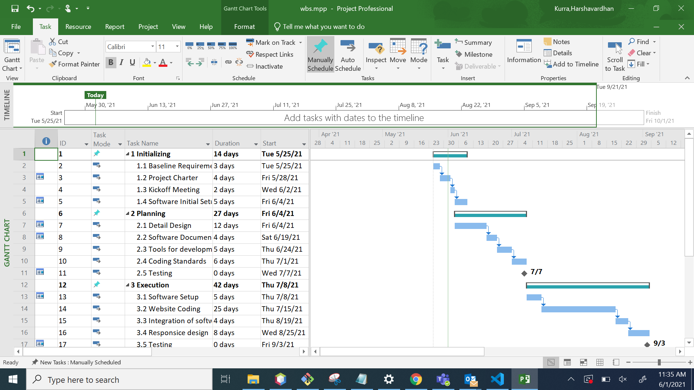
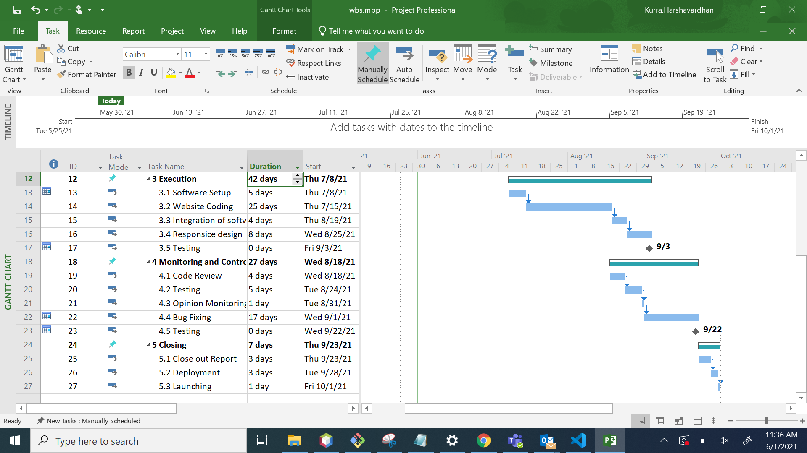
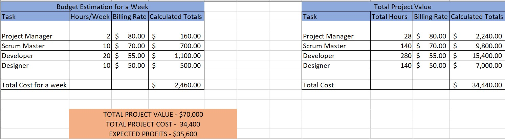

# pm-s04-g02-project

## > OUR PROJECT
**Project Title:** TYRE SUPPLIERS     
Get your car rolling in style

The Main Objective of the project is to create a website for sales in tyres. It has several logins, such as admin, customer, warhouse incharge, retailer etc. Admin gives access to the users, based on their role. Retailer posts all the tyres which are available in warehouse. Warehouse Incharge takes care of order management for their shipment.

## > OUR TEAM
- **HARSHAVARDHAN KURRA** 
- **RAHUL DASARI** 
- **ABHILASH DHUMALA** 
- **ARNAV AKULA** 

    

## > PROJECT CHARTER

The project charter contains the start and end date of project, budget information, objectives for building the project and approach for it. It also describes the roles and responsibilities of each person involving in the project.

For more details click on the following link
[charter.md](charter.md)

## > SCOPE
### Work Breakdown Structure
<pre>
1. Initiating
    1.1 Baseline Requirements
    1.2 Project Charter
    1.3 Kickoff Meeting
    1.4 Software Initial Setup
2. Planning
    2.1 Detail Design
    2.2 Software Documentation
    2.3 Tools for Development
    2.4 Coding Standards
3. Executing
    3.1 Software Setup
    3.2 Website Coding
    3.3 Integration of Software
    3.4 Responsive Design
4. Monitoring and Controlling
    4.1 Code Review
    4.2 Testing
    4.3 Opinion Monitoring 
    4.4 Bug Fixing
5. Closing
    5.1 Closeout Report
    5.2 Deployment
    5.3 Launching
</pre>

## > SCHEDULE
- Start date 05/25/2021
- End date 10/1/2021
- Duration 14Weeks
- 
-  

## > BUDGET
- Total project Value is $70,000
- Total Project Cost is $34,400
- Estimated Profits is $35,600
- 
